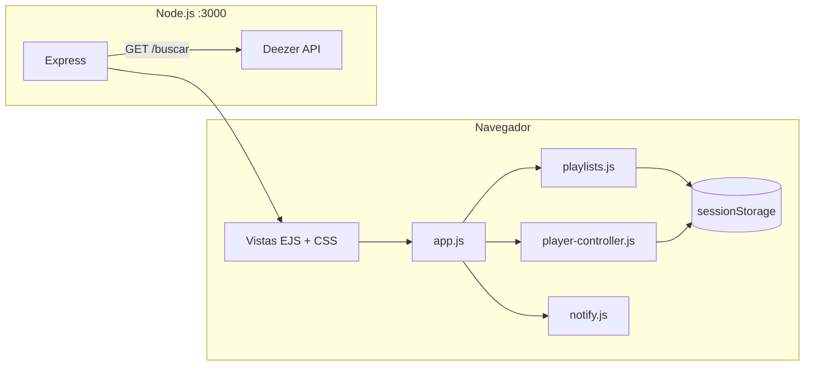

# MoodTunes

Aplicación web para descubrir música por estado de ánimo, escuchar previews de Deezer y organizar tus canciones favoritas en playlists personalizadas. Interfaz oscura inspirada en Spotify y Deezer, con reproductor global fijo y gestión de playlists en el navegador.

## Descripción

**MoodTunes** permite buscar canciones reales mediante la [API pública de Deezer](https://developers.deezer.com/api), reproducir fragmentos de audio (preview), guardar pistas con metadatos completos y agruparlas en una o varias playlists creadas por el usuario.

El servidor Node.js se encarga de la búsqueda y del renderizado de vistas; la persistencia de playlists y el estado del reproductor viven en **`sessionStorage`**, sin base de datos en el backend.

## Características principales

### Búsqueda y descubrimiento
- Búsqueda por mood, artista o género desde la página de inicio.
- Chips rápidos (Feliz, Relax, Rock, Reggaeton, etc.).
- Resultados con portada, título, artista, álbum y preview de Deezer.

### Interfaz (UI/UX)
- Tema oscuro con acentos verdes y tipografía DM Sans.
- Layout con barra lateral, cards animadas y diseño responsive.
- Estados vacíos y feedback visual al guardar o reproducir.

### Reproductor de audio
- Controles personalizados (sin barra nativa del navegador en las cards).
- **Barra fija inferior** estilo Spotify: permanece visible al hacer scroll.
- Un solo preview sonando a la vez; progreso y tiempos sincronizados.
- **Volumen** solo en la barra inferior (persistente en la sesión).
- Play desde la portada o desde el mini-reproductor de cada card.

### Playlists (sessionStorage)
- Crear **varias playlists** con nombre, descripción y emoji.
- Modal propio para crear playlists (grid de emojis + campo personalizado).
- Obligatorio crear una playlist antes de guardar la primera canción.
- Selector «Guardar en» en resultados para elegir destino.
- Vista de playlists con sidebar, descripción y listado de pistas.
- Datos guardados por pista: `id`, título, artista, álbum, portada, preview, duración y enlace Deezer.

### Notificaciones
- [Notification API](https://developer.mozilla.org/es/docs/Web/API/Notifications_API) del sistema operativo (con permiso del navegador).
- Toast en pantalla como respaldo cuando no hay permiso o no está soportado.

## Tecnologías

| Área | Stack |
|------|--------|
| Backend | [Node.js](https://nodejs.org/) + [Express 5](https://expressjs.com/) |
| Vistas | [EJS](https://ejs.co/) |
| API música | [Deezer API](https://api.deezer.com/) vía [Axios](https://axios-http.com/) |
| Frontend | HTML, CSS y JavaScript vanilla |
| Persistencia playlists | `sessionStorage` (clave `moodtunes_data`) |
| Estado reproductor | `sessionStorage` (clave `moodtunes_player`) |

> **Nota:** En `package.json` aún aparecen `nedb` y `nedb-promises` de una versión anterior; el flujo actual **no usa** base de datos en servidor para playlists.

## Arquitectura



1. El usuario busca en `/buscar`; Express consulta Deezer y renderiza `resultados.ejs`.
2. Al reproducir, `player-controller.js` usa un único `<audio>` en la barra global.
3. Al guardar, `playlists.js` escribe en `sessionStorage` (solo en la pestaña actual).
4. `/ver-playlist` renderiza la vista; el listado se construye en el cliente con `app.js`.

## Estructura del proyecto

```
proyectoFinal/
├── server.js                 # Rutas Express
├── package.json
├── public/
│   ├── style.css             # Estilos globales, player y modal
│   ├── app.js                # UI, modal, guardado, página playlists
│   ├── playlists.js          # CRUD playlists (sessionStorage)
│   ├── player-controller.js  # Reproductor global fijo
│   └── notify.js             # Notificaciones nativas
├── views/
│   ├── index.ejs             # Inicio + búsqueda
│   ├── resultados.ejs        # Grid de canciones Deezer
│   ├── mi-playlist.ejs       # Gestión de playlists (cliente)
│   └── partials/
│       ├── head.ejs
│       ├── nav.ejs
│       ├── player.ejs        # Mini player en cards
│       ├── global-player.ejs # Barra inferior fija
│       ├── playlist-modal.ejs
│       └── layout-end.ejs    # Scripts y componentes globales
└── data/                     # Legado (playlists.db — ya no usado por el servidor)
```

## Rutas del servidor

| Método | Ruta | Descripción |
|--------|------|-------------|
| `GET` | `/` | Página de inicio |
| `GET` | `/buscar?mood=...` | Búsqueda en Deezer y resultados |
| `GET` | `/ver-playlist` | Vista de playlists (datos en el cliente) |

## Instalación y uso

1. **Clonar el repositorio**
   ```bash
   git clone https://github.com/izzycaicedx/proyectoFinal.git
   cd proyectoFinal
   ```

2. **Instalar dependencias**
   ```bash
   npm install
   ```

3. **Iniciar el servidor**
   ```bash
   node server.js
   ```

4. **Abrir en el navegador**  
   [http://localhost:3000](http://localhost:3000)

### Flujo recomendado

1. Busca música por mood o término.
2. Crea una playlist (**+ Crear playlist**) con nombre, emoji y descripción.
3. Acepta las **notificaciones** del navegador si quieres alertas del sistema.
4. Reproduce previews; la barra inferior seguirá visible al bajar la página.
5. Pulsa **Guardar** y elige la playlist en el selector.
6. Revisa todo en **Mis playlists**.

## Permisos del navegador

- **Notificaciones:** la primera interacción puede solicitar permiso. Sin permiso, solo verás el toast en la app.
- **Audio:** los previews requieren interacción del usuario (clic en play) por políticas del navegador.

## Limitaciones conocidas

- Las playlists y el volumen se guardan en **`sessionStorage`**: se pierden al cerrar la pestaña o el navegador (no se comparten entre pestañas).
- Solo se guardan canciones con **preview** disponible en Deezer (~30 s).
- La API de Deezer es pública; no requiere API key para búsquedas básicas.

## Equipo

| Integrante | Rol |
|------------|-----|
| **Isabella Pinzón** | Servidor Express, integración Deezer, arquitectura |
| **Sebastian Arias** | UI/UX, CSS, reproductor, playlists y notificaciones en frontend |

---

**MoodTunes** — encuentra tu sonido, crea tu playlist.
